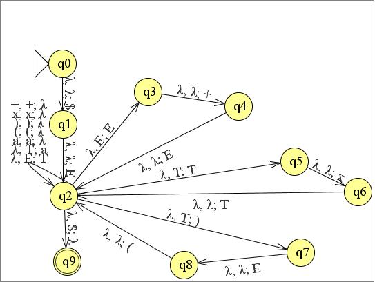

# FOCS Homework 10, for Day 11

You may edit your answers into this file, or add a separate file in the same directory.

If you add a separate file, please include the following at the top:

```
Student Name: Lucy Wilcox
Check one:
[ ] I completed this assignment without assistance or external resources.
[x] I completed this assignment with assistance from ___
   and/or using these external resources: Sipser, JFlap, Oliver Steel
```

## I. Logic

### 1.

The following tables are [truth tables](https://en.wikipedia.org/wiki/Truth_table).

_true_ and _false_ are represented by `T` and `F`. _OR(false, true)_ is commonly written in [infix notation](https://en.wikipedia.org/wiki/Infix_notation): `F OR T`.

The second table shows the value of the function _a OR b_, for all possible values _a_ and _b_. For example, _false OR true_ (the second row) has the value _true_ (the final cell of that row).

_a_ | _b_ | _a_ AND _b_
----|-----|---
 F  |  F  | F
 F  |  T  | F
 T  |  F  | F
 T  |  T  | T

_a_ | _b_ | _a_ OR _b_
----|-----|---
 F  |  F  | F
 F  |  T  | T
 T  |  F  | T
 T  |  T  | T

_a_ | _b_ | _a_ XOR _b_
----|-----|---
 F  |  F  | F
 F  |  T  | T
 T  |  F  | T
 T  |  T  | F

a. Construct the truth table for _a XOR (b XOR a)_.

_a_ | _b_ | _a_ XOR (_b_ XOR _a_)
----|-----|---
 F  |  F  |  F
 F  |  T  |  T
 T  |  F  |  F
 T  |  T  |  T

b. Which function corresponds to the English word "or", as used in "You will eat your meat OR you can't have any pudding" (where _a_ = "You will eat your meat" and _b_ = "you can't have any pudding").

Normal OR.
```
I don't eat meat and do eat pudding: F F -> F
I don't eat meat and do not eat pudding: F, T -> T
I do eat meat and don't eat pudding: T, T -> T (you don't have to eat the pudding)
I do eat meat and do eat pudding: T, F -> T
```

## II. Questions 2–6 are the same as in-class activities 2-6

### 2.

Consider the following context-free grammar G:

```
E -> E + E | T         # <- added "| T"
T -> T x T | (E) | a
```

Convert G to a PDA.



### 3.

Convert grammar G from (2) to Chomsky Normal Form.

E<sub>0</sub> -> EE<sub>1</sub> | TT<sub>1</sub> | E<sub>3</sub>E<sub>2</sub> | a

E -> EE<sub>1</sub> | TT<sub>1</sub> | E<sub>3</sub>E<sub>2</sub> | a

T -> TT<sub>1</sub> | E<sub>3</sub>E<sub>2</sub> | a

E<sub>1</sub> -> PE

T<sub>1</sub> -> MT

E<sub>2</sub> -> E<sub>1</sub>R

E<sub>3</sub> -> LE

P -> +

M -> x

L -> (

R -> )

### 4.

Is the grammar G's language a regular language? If yes, produce a FSA or regular expression for this language. If not, show this. 

It is not a regular grammar. 'E + E' is in the the language, this can be looped and E + EE + E is not in the language.

### 5.

Theorem 1: The language {a^n b^n c^n} is not a context-free language.

a. Use Theorem 1, together with the languages {a^i b^i c^j} and {a^i b^j c^j}, to show that the set of context-free languages is not closed under intersection.

Let L1 = {a^i b^i c^j} , L2 = {a^i b^j c^j}.

In L1 there is a pumping that works for this context-free language.

s = aaabbbc

u = a

v = a

x = ab

y = b 

z = bc

When v and y are looped, lets say twice for example, we get a string like: aaaabbbbc, which is still in the language. This will work so long as v is some subset of a chars and y is some subset of b chars. Likewise for L2 the same logic can be used, but v must be some subset of b chars and y some subset of c chars.

However the intersection of L1 and L2 is not a context free language because of Theorem 1. Therefore the set of context free languages is not closed under intersection.

b. Use the pumping lemma for context-free languages [Sipser pp. 125] to prove Theorem 1.

Strings, s, in the language cannot be divide into five pieces s = uvxyz where uv^ixy^iz is also in the language. 

Let's look at aaabbbccc. If any one element, or one set of elements is pumped, it's clear the resulting string is not in the language. For instance aaaabbbccc (u = null, v = a, x = aa, y = null, z = bbbccc ) or aaabababbbccc (u = aa, v = ab, x = null, y = null, z = bbccc).

This will also not work if y is not null. v and y, our two looping parts can either consist of one character type, a, b or c (e.g. a, aa, aaa, b), a set of two character types (e.g. ab, abb, aabb, bbbccc) or one which is a set of two types and one a set of three types (e.g. aa and abbbc). v and y cannot have more than character type, if it did part of the string would be something like abab or abbbcabbbc, any string of this type is not in the language. However, if any v is of one character type, and y is of another, then when these are looped there will be more of two types of characters and the resulting string will not be in the language.


### 6.

Consider the context-free grammar G:

```
S -> NP VP
NP -> NP PP
NP -> DET N
VP -> V NP
VP -> VP PP
DET -> a | the
N -> boy | girl | flowers | binoculars
V -> touches | sees
PP -> P NP
P -> in | from | with
```

a. Show that the string "the girl touches the boy with the flower" has two
different leftmost derivations.

S
NP VP
DET N VP
the girl VP PP
the girl V NP PP
the girl touches NP PP
the girl touches DET N PP
the girl touches the boy P NP
the girl touches the boy with DET N
the girl touches the boy with the flower

S
NP VP
DET N VP
the girl V NP
the girl touches NP PP
the girl touches DET N PP
the girl touches the boy PP
the girl touches the boy P NP
the girl touches the boy with DET N
the girl touches the boy with the flower

b. Describe in English the two different meanings of this sentence.

One sentence describes a girl using a flower to touch a boy. The other sentence describes a girl touching a boy who is holding a flower.

c. Use G to generate another ambiguous sentence.

A boy sees the flowers with the binocular.

S -> NP VP -> DET N VP -> DET N VP PP -> DET N V NP PP -> DET N V DET N PP -> DET N V DET N P NP -> DET N V DET N P DET N

or 

S -> NP VP -> DET N VP -> DET N V NP -> DET N V NP PP -> DET N V DET N PP -> DET N V DET N P NP -> DET N V DET N P DET N

d. Modify G so that it generates strings with adjectives: `the girl saw the tall boy`, `the girl touches the boy with a purple flower`.


```
S -> NP VP
NP -> NP PP
NP -> DET N
NP -> DET NA
VP -> V NP
VP -> VP PP
NA -> A N
DET -> a | the
N -> boy | girl | flowers | binoculars
V -> touches | sees | saw
PP -> P NP
P -> in | from | with
A -> purple | tall
```

You don't need to know this, but here's how the variable names relate to linguistics.

Variable | meaning
---|---
S | sentence
DET | determiner (article)
N | noun
NP | noun phrase
P | preposition
PP | prepositional phrase
V | verb
VP | verb phrase

[Adapted from Sipser 2.8.]
