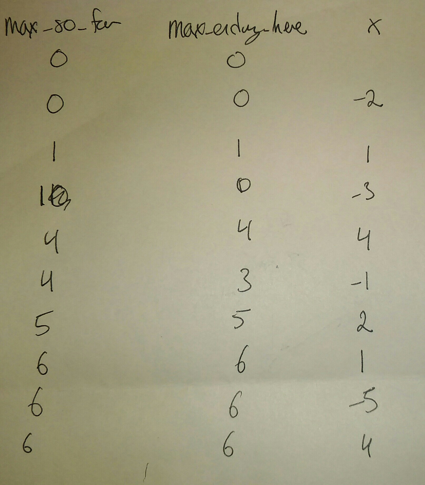
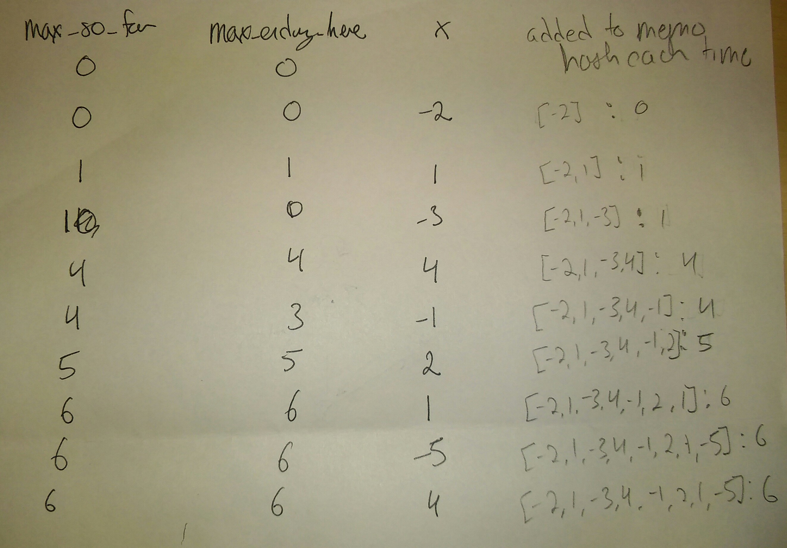

# FOCS Homework 19

You may edit your answers into this file, or add a separate file in the same directory.

If you add a separate file, please include the following at the top:

```
Student Name: Frankly Olin [change to your name]
Check one:
[ ] I completed this assignment without assistance or external resources.
[ ] I completed this assignment with assistance from ___
   and/or using these external resources: ___
```

## 0. [Not a question] Terminology

In class on Monday, we drew [**call graphs**](https://en.wikipedia.org/wiki/Call_graph) of the `fib` function, with and without memoization.

This particular kind of call graph is a **dynamic call graph**, whose nodes are function *invocations* during the execution of a program. The nodes of a **static call graph** are function *names*; arrows indicate appearances of a call in the program source text.

A dynamic call graph of a *recursive* function is also called a **recursion graph**.

## 1. Predicate Calculus – Models

Consider Table 1:

| x    | y    |
| ---- | ---- |
| a    | b    |
| b    | c    |
| a    | c    |
| c    | d    |
| d    | c    |
| c    | c    |
| b    | a    |

*Table 1*: A model for `loves(x, y)`

a. For each of the following, is Table 1 a model?  Explain briefly why or why not.

1. ∃x. ∀y. loves(x, y)
   
   False, there is no x that loves all y.

2. ∃y. ∀x. loves(x, y)

   True, c (in y) is loved by all x.

3. ∀x. ∃y. loves(x, y)

   True, each value of x loves at least one value of y.

4. ∀y. ∃x. loves(x, y)

   True, each value of y is loved by at least one value of x. b is loved by a, c is loved by b, a is loved by b, d is loved by c.

5. ∃x. ∃y. loves(x, y)

   There exists and x which loves a y, for example a loves b.

6. ∃x. ∀y. ¬loves(x, y)

   False, there is not a x which does not love every y.

7. ∃x. ¬∀y. loves(x, y)

   This is the same as ∃x. ∃y. ¬loves(x, y). There exists a x and y such that x does not love y, for example, d does not love a.

b. Consider three models: (i) objects are a, b, c, d; `loves` is Table 1; (ii) objects are integers; `loves(x, y) ` ≝ x ≧ y; (iii) `loves(x, y)` ≝ x = y. In which of these models are these statements true:

| Statement                                | Table 1 | x ≧ y | x = y |
| ---------------------------------------- | ------- | ----- | ----- |
| ∀x, x. loves(x, x)                       |   False   |   True  |   True    |
| ∀x, y. loves(x, y) → loves(y, x)         |    False   |    False   |   True    |
| ∀x, y, z. loves(x, y) ∧ loves(y, z) → loves(x, z) |    False   |   True  |   True    |

c. (Optional) (Because we love graphs) Draw Table 1 as a digraph. What claims do each of the following make about a node x or y, in terms of its indegree and outdegree?

1. ∀x. loves(x, y)
2. ∀y. loves(x, y)
3. ∃x. loves(x, y)
4. ∃y. loves(x, y)

## 2. Predicate Calculus – Proofs

Given axioms:

1. ∀x. sum( x, 0, x )
2. ∀x, y, z. sum( x, y, z ) → sum( x, s(y), s(z) )
3. ∀x . product( x, 0, 0 )
4. ∀x, y, z, k. product( x, y, z ) ∧  sum( x, z, k ) → product( x, s(y), k )

Prove:

1.  ∃x. sum( x, x, s(s(0)) )

   a. ∃x. x = s(0)
   
   b. ∃x. sum(x, 0, s(0))   1 a
   
   c. ∃x. sum(x, s(0), s(s(0)) 2 b
   
   d. ∃x. sum(x, x, s(s(0)) 1 3

2.  ∀x. sum( 0, x, x ) [hint:  induction]

   a. ∃x. x = 0
   
   b. ∃x. sum(0, 0, 0) 1 a
   
   c. ∃y. sum(0, y, y) inductive hypothesis
   
   d. ∀x. ∃y. x = s(y) inductive step
   
   e. ∀x. ∃y. sum(0, s(y), s(y)) c d
   
   f. ∀x. sum(0, x, x) e a

3.  [optional super-challenge] ∀x, y, z. sum( x, y, z ) → sum( y, x, z )

## 3. Maximum Subarray

The [maximum subarray problem](https://en.wikipedia.org/wiki/Maximum_subarray_problem) (*aka* maximum contiguous subsequence, *aka* maximum value contiguous subsequence) is “the task of finding the contiguous subarray within a one-dimensional array of numbers which has the largest sum. For example, for the sequence of values −2, 1, −3, 4, −1, 2, 1, −5, 4; the contiguous subarray with the largest sum is 4, −1, 2, 1, with sum 6” ([Wikipedia](https://en.wikipedia.org/wiki/)).

```python
# Source: wikipedia 
def max_subarray(xs):
    max_ending_here = max_so_far = 0
    for x in xs:
        max_ending_here = max(0, max_ending_here + x)
        max_so_far = max(max_so_far, max_ending_here)
    return max_so_far
```

a. Draw a recursion graph of `max_subarray([−2, 1, −3, 4, −1, 2, 1, −5, 4])`.

   

b. Is `max_subarray` an example of divide and conquer? Why or why not?

   No, it is incrementing through an array, not spliting the array into smaller parts and dealing with those smaller parts.

c. Is `max_subarray` an example of dynamic programming? Why or why not?

   Yeah, it updates max_ending here and max_so_far as it goes to allow it to always update

d. Consider a *memoized* version of `max_subarray`. (You don't need to produce code for this. You do need to understand what memoization does to a call graph.) Draw the recursion graph for `memoized_max_subarray([−2, 1, −3, 4, −1, 2, 1, −5, 4])`.
   
   You could store the results of maxes of all subarrays so which could be checked in the future when the fuction is called. The entries in the last column are the entries that would be added. 
   

e. [Optional challenge] Produce working code for memoized `max_subarray`.

## 4. Binary Search

```python
def binary_search_array_helper(x, xs, left, right):
    if left == right: return None
    middle = int((left + right) / 2)
    if x < xs[middle]:
        return binary_search_array_helper(x, xs, left, middle)
    elif xs[middle] < x:
        return binary_search_array_helper(x, xs, middle, right)
    else:
        return middle

def binary_search_array(x, xs):
    return binary_search_array_helper(x, xs, 0, len(xs))
```

a. Above is an implementation of the [binary search algorithm](https://en.wikipedia.org/wiki/Binary_search_algorithm). Draw the recursion graph for `binary_search_array(3, [1, 3, 4, 6, 7, 8, 10, 13, 14]))`.

b. Is `binary_search_array` an example of divide and conquer? Why or why not?

   Yes, it's breaking the array up into smaller arrays to and sorting them. 

c. Is `binary_search_array` an example of dynamic programming? Why or why not?

   No, nothing is being store via either memoization or bottom up dynamic programming. The sorted smaller arrays are returned but there  is no instance where the previously calulations are being reused. 

d. Consider a memoized version of `binary_binary_search_array_helper`. Draw the recursion graph for a function memoized `memoized_binary_search_array(3, [1, 3, 4, 6, 7, 8, 10, 13, 14]))` that calls `memoized_binary_search_array_helper`.

   

e. Under what circumstances does the `memoized_binary_search_array` present any benefits over the unmemoized original? How does this relate to (i) its recursion graph; (ii) the key attributes of a dynamic program?

   Lets say you have a big sql table and you have it sorted via some numeric column in some b-tree for lookup. But maybe several of the   entries are more heavily accessed than others and nothing is added to the table. You could use this memozation as a cache of sorts for this array where you use the previous results and it stores the most common/recent results. This isn't really breaking it up into smaller sub problems though so I'm not sure what you're looking for.

f. [Optional challenge] Find the bug in `binary_search_array`. What input will cause it to fail? How can this be fixed? (Hint: it is a bug that appears for small arrays. Python is not susceptible to [this bug](https://research.googleblog.com/2006/06/extra-extra-read-all-about-it-nearly.html).)

## 5. Datalog Tutorial

Dust off your DrRacket, and follow the Datalog tutorial [here](https://docs.racket-lang.org/datalog/Tutorial.html).

Done

## 6. SQL

Install [SQLite](https://www.sqlite.org):

* **Linux**: `sudo apt-get install sqlite`
* **macOS** (w/ [homebrew](http://brew.sh)): `brew install sqlite3`
* **Windows**; **macOS** (w/out homebrew): download the pre-compiled binary from the [SQLite Download Page](https://sqlite.org/download.html)

Kick its tires:

```
$ sqlite3
SQLite version 3.13.0 2016-05-18 10:57:30
Enter ".help" for usage hints.
Connected to a transient in-memory database.
Use ".open FILENAME" to reopen on a persistent database.
sqlite> create table course(title string, number string, area string, credits int);
sqlite> insert into course values ("FOCS", "ENGR3520", "ENGR", 4);
sqlite> insert into course values ("SoftDes", "ENGR2510", "ENGR", 4);
sqlite> insert into course values ("Discrete", "MTH2110", "MTH", 4);
sqlite> .mode column
sqlite> .headers on
sqlite> select * from course;
title       number      area        credits
----------  ----------  ----------  ----------
FOCS        ENGR3520    ENGR        4
SoftDes     ENGR2510    ENGR        4
Discrete    MTH2110     MTH         4
sqlite> select * from course where area="ENGR";
title       number      area        credits
----------  ----------  ----------  ----------
FOCS        ENGR3520    ENGR        4
SoftDes     ENGR2510    ENGR        4
sqlite> .quit
```
Done
